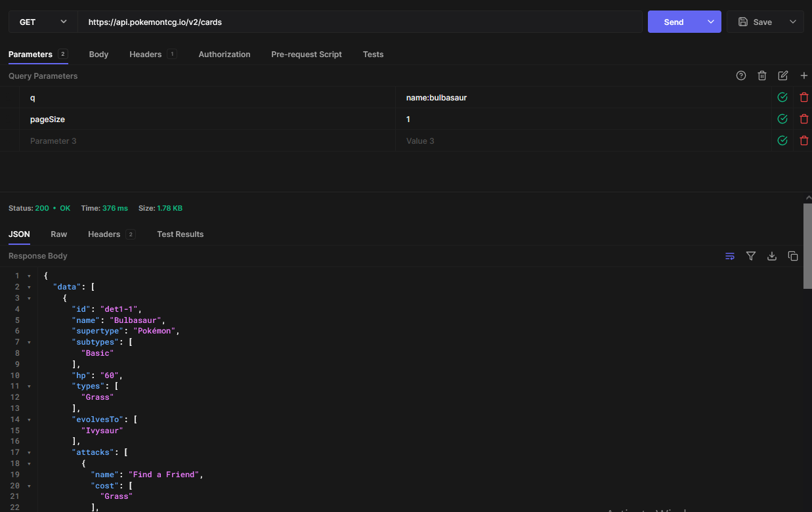

# CSC207-Project
This project will be a simplified platform for everything Pokemon tcg related, using the Pokemon card api. It'll feature deck building, battling locally, a store for purchasing and selling tcg cards, and maybe even online matches.

Our goal is to create a hub where both TCG players and TCG card collectors can gather to find information, share their own ideas, and experiment with their decks. After users create their accounts, they will have the option to build customized decks using all available Pokémon TCG cards and challenge other players to test their decks. Users can also share their deck ideas and strategies with others, as well as search for decks and cards with the best synergies based on information shared by the community.

Furthermore, by incorporating a marketplace for TCG cards, we aim to attract Pokémon card collectors to our platform, fostering a thriving environment.

# User Stories
- Jimmy wants to browse all the cards in the new set, so he uses the card viewer and applies filters to refine his search.
- Justin wishes to try a deck that includes a combination of Pokémon he's never used before and doesn't physically own. He duplicates his usual deck, adds these new cards, and then starts a game with his friend to test it out.
- Frederico is interested in switching out his current deck for a new one. He checks the prices of his cards to prepare for selling them and then searches the database of decks for a potential replacement.
- Oliver experiences a loss in a battle and reviews the match logs to understand why. The client provides him with a summary of the performance of the Pokémon he used and a list of the events that occurred during the match.

# Entities

Class Card
Class CardInstance
Class CardStack
Class PlayerState
Class GameState
Class ActiveAbility
Class Deck
Class User
Class SellListing
Class DatabaseAccessObject
Class PokemonGuruApiObject

# API documentation
https://docs.pokemontcg.io/

# Usage example

# UML Diagram
https://docs.google.com/drawings/d/17H3lf1jQ2WkPr8LSaVP1RicslJ-A33M8ZlaVulrb_PI/edit?usp=sharing
