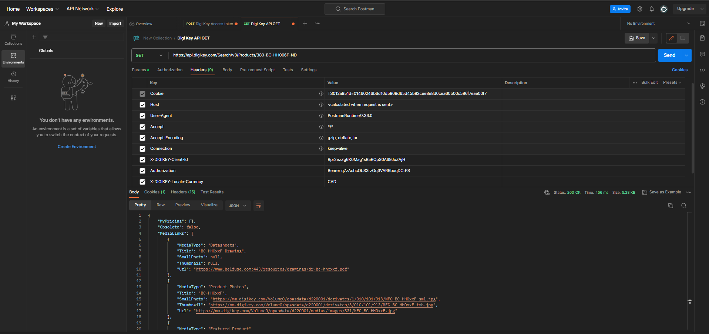

# CSC207-Project-Description
This is a repository for our CSC207 project. For this project we would like to work on a project domain based on an 
inventory management system for an electronics company. 

In developing this application, we would love to add features that include product descriptions such as the costs,
seller information and any other detail/ features related to the product we have in our inventory (what it does, 
how much is available for us to buy). We also plan to introduce an ordering function where, based on our current level 
of inventory, we can recommend items which need to be restocked. Going on a more complex route on our ordering, we can 
implement a cost-price algorithm which recommends a product to buy more of based on the analyses the trends of sales of 
a product (the amount sold and at what price), comparing it to the current seller's price and whether there is 
great profit to be gained. Some more basic uses of our inventory management system would be to use it to measure and 
record the amount of transactions (helps with audit trailing), calculating profits and losses, and lastly, forecasting 
(predicting the future inventory needs). 

A potential API we plan to use is called Digi-Key API, found at: https://developer.digikey.com/. DigiKey Corporation is 
an American corporation which deals with the distribution of electronics. We plan on using its api to collect information 
regarding their products which we can use in our business discussions. There are many other APIs which we can use to 
collect product information. Another example of this would be the BestBuy API, found at: https://bestbuyapis.github.io/api-documentation/#response-format.

Using Postman, we can try out the API by searching for a product listed on the DigiKey website (for example, we can get 
the product details for a HDMI cord of product number: 380-BC-HH006F-ND);

# Postman Screenshot

# Java Code

Using Postman, we are able to generate some code that would help us access the API and use it to provide us with details 
of the products, unfortunately, this code appears to have some errors and does not return a similar result of that, when 
using Postman. The output of the Postman API call is however included in the repository.

# Technical Problems

As stated above the java code does not appear to give the same result as if we were to use the Postman tool to access 
DigiKey products and their details (output of the postman query is shown in the "api response.json" file). Other 
potential problems that arose in this brainstorming session is that some API are paid and others (like the BestBuy API) 
require strict authorization to use. DigiKey was used as it was a free (although quite complex setup) with no organization 
authorization needed. If we were to use the other APIs instead, we would need more time to address these technical issues.

